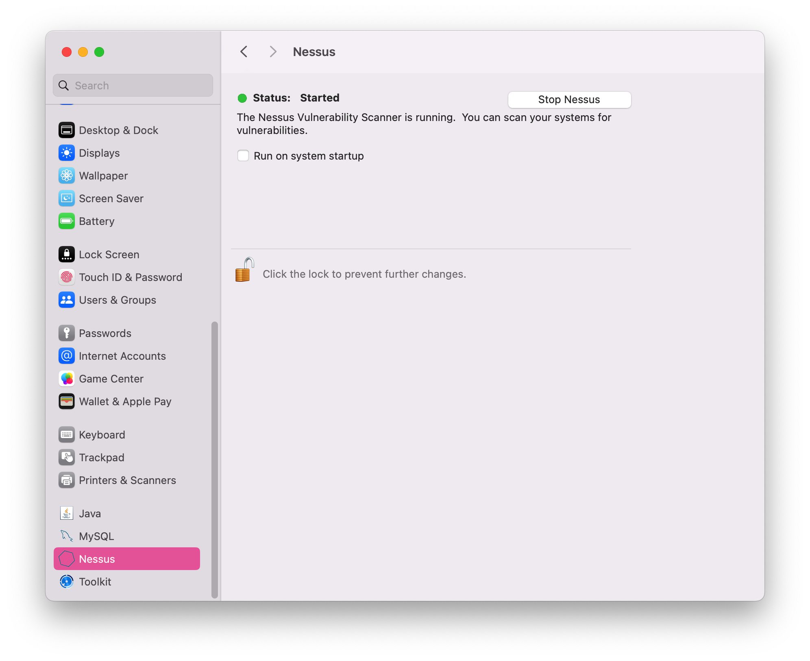
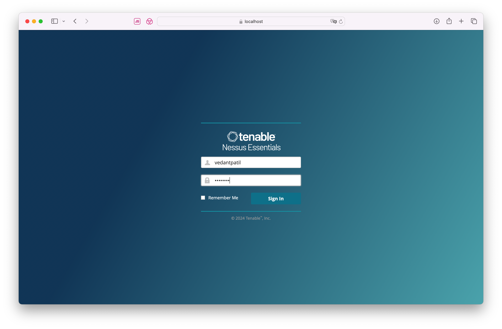
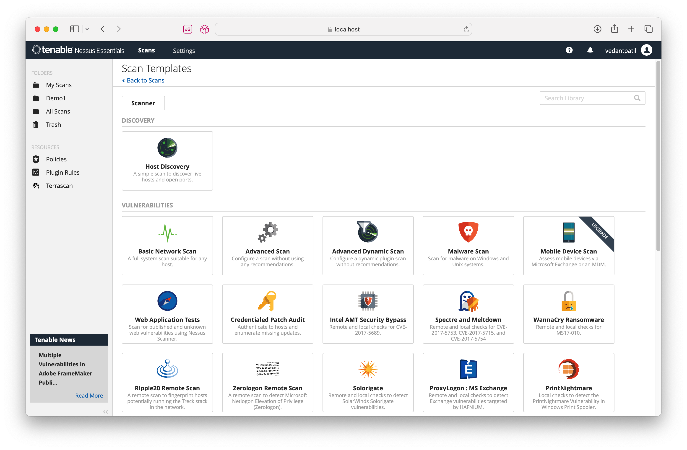
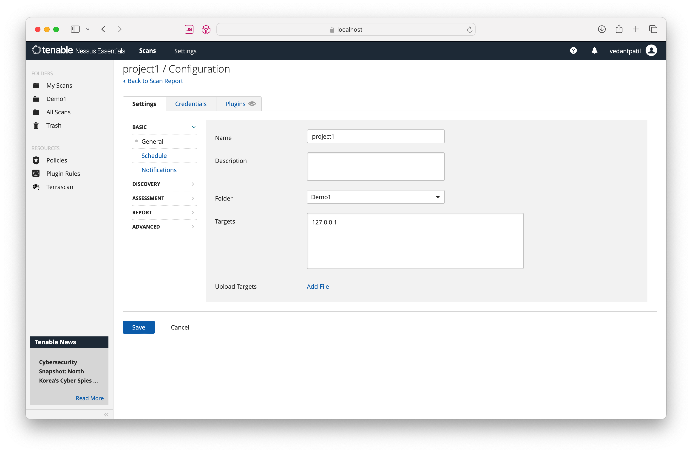

# Vulnerability Assessment Project

## Overview

This project involves the installation, configuration, and utilization of the Nessus vulnerability scanner on macOS to perform comprehensive vulnerability assessments. The project aims to identify and analyze system vulnerabilities and develop effective remediation strategies.

## Features

- **Nessus Installation and Configuration**: Installed and configured the Nessus vulnerability scanner on macOS.
- **Comprehensive Vulnerability Scans**: Conducted detailed vulnerability scans using Nessus, including credentialed scans to uncover more in-depth vulnerabilities.
- **Vulnerability Identification and Analysis**: Identified and analyzed system vulnerabilities, including testing with deliberately installed vulnerable software.
- **Remediation Strategies**: Developed and implemented effective remediation strategies to address and mitigate identified vulnerabilities.

## Identified Vulnerabilities

Some of the identified vulnerabilities included outdated versions of the following software:
- Google Chrome
- VLC Media Player
- Mozilla Firefox
- Node.js
- Zoom
- Ruby

## Installation

1. **Download Nessus**: Obtain the Nessus installer for macOS from the [Tenable website](https://www.tenable.com/products/nessus).
2. **Install Nessus**: Follow the installation instructions provided by Tenable.
3. **Configure Nessus**: Configure Nessus according to your network environment and scanning requirements.

## Usage

1. **Find IP Address**: Use the `ifconfig` command in the macOS terminal to find your IP address.
2. **Run Nessus**: Start the Nessus service.
3. **Login to Nessus**: Access the Nessus web interface and log in.
4. **Conduct Scans**: Create and configure a new scan in Nessus, and perform vulnerability scans on your system. Ensure to include credentialed scans for comprehensive results.
5. **Analyze Results**: Review the identified vulnerabilities and their potential impact on the system.
6. **Remediation**: Develop and implement strategies to address the identified vulnerabilities.

## Screenshots

Here are some screenshots illustrating the method and results:

1. **Starting the Nessus Service**

2. **Nessus Login**

3. **Creation of Scan**

4. **Configuration of Scan**

## PDF Reports

Detailed reports showing the vulnerability status before and after remediation:

- **Before Remediation**: [Before_Report.pdf](Before_Report.pdf)
- **After Remediation**: [After_Report.pdf](After_Report.pdf)

## Contributing

If you would like to contribute to this project, please fork the repository and submit a pull request with your proposed changes.

## License

This project is licensed under the MIT License - see the [LICENSE](LICENSE) file for details.
